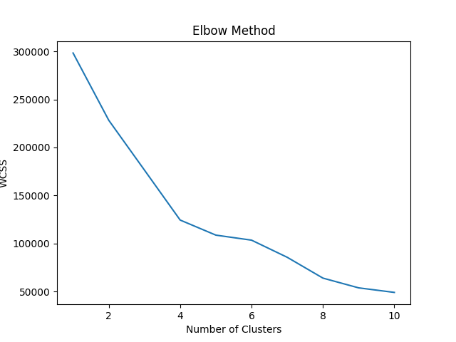
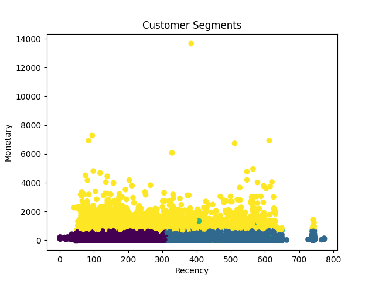

# 🚀 RFM Customer Segmentation using K-Means

End-to-end customer segmentation project using RFM analysis and K-Means clustering to identify high-value customers and drive business decisions.

## 📌 Problem Statement

In today's competitive market, businesses struggle to identify their most valuable customers and optimize marketing strategies accordingly.
This project aims to segment customers based on their purchasing behavior using **RFM (Recency, Frequency, Monetary) analysis** and **KMeans clustering**, enabling data-driven decision-making.

---

## 🎯 Objective

* Identify high-value customers
* Detect at-risk and inactive customers
* Enable targeted marketing strategies
* Improve customer retention and revenue

---

## 📊 Dataset Information

* Source: Ecommerce dataset (Olist)

* Key Features:

  * Customer ID
  * Order Purchase Timestamp
  * Payment Value

* Dataset includes:

  * Customer transactions
  * Order details
  * Payment information

---

## 🧠 Understanding RFM Analysis

RFM is a powerful customer segmentation technique:

* **Recency (R):** How recently a customer made a purchase
* **Frequency (F):** How often a customer purchases
* **Monetary (M):** How much money a customer spends

👉 Customers with:

* Low Recency + High Frequency + High Monetary = **High Value Customers**

---

## ⚙️ Project Workflow

### 1️⃣ Data Cleaning & Preprocessing

* Removed null values
* Handled duplicates
* Converted date columns to datetime format

### 2️⃣ RFM Feature Engineering

* Calculated Recency, Frequency, and Monetary values for each customer

### 3️⃣ Data Scaling

* Applied feature scaling to normalize data

### 4️⃣ Clustering using KMeans

* Implemented KMeans clustering algorithm
* Optimal number of clusters selected using **Elbow Method**

---
## 🐍 Python Implementation

The complete RFM analysis and clustering were implemented using Python.

👉 View Notebook (GitHub):  
[Open Notebook](https://github.com/anjeetyadav/RFM-Customer-Segmentation-KMeans/tree/main/notebook)

👉 View Notebook (Better View):  
[Open in NBViewer](https://nbviewer.org/github/anjeetyadav/RFM-Customer-Segmentation-KMeans/tree/main/notebook/))

---

## 📈 Clustering Visualization

### 🔹 Elbow Method

### 🔹 Customer Segmentation (Clusters)

---

## 📊 Power BI Dashboard

An interactive dashboard was created using Microsoft Power BI to visualize customer segments and business insights.

### 🔹 Dashboard Preview

### 📌 Dashboard Insights:

* Customer distribution across segments
* Revenue contribution by each segment
* Identification of high-value customers
* Interactive filtering for deeper analysis

---

## 👥 Customer Segments

| Segment              | Description                                      |
| -------------------- | ------------------------------------------------ |
| 🟢 VIP Customers     | High spenders, frequent buyers, recent purchases |
| 🔵 Loyal Customers   | Frequent buyers with consistent engagement       |
| 🟡 At Risk Customers | Haven’t purchased recently                       |
| 🔴 Lost Customers    | Inactive customers                               |

---

## 💼 Business Recommendations

* **VIP Customers**
  → Provide loyalty rewards, exclusive deals, premium services

* **Loyal Customers**
  → Upsell and cross-sell products

* **At Risk Customers**
  → Offer personalized discounts and reminders

* **Lost Customers**
  → Run re-engagement campaigns and email marketing

---

## 🔍 Key Insights

* Top customers contribute significantly to overall revenue
* A small percentage of customers generate the majority of sales (Pareto Principle)
* Identifying at-risk customers helps reduce churn

---

## 🛠️ Tools & Technologies Used

* Python (Pandas, NumPy, Matplotlib, Seaborn, Scikit-learn)
* Jupyter Notebook
* Microsoft Power BI

---

## 📁 Project Structure

* Data Cleaning & Preprocessing
* RFM Feature Engineering
* Clustering Model
* Visualization
* Dashboard

---

## 🔍 Key Business Insights
- Top 20% of customers contribute to majority of revenue  
- High Recency customers require re-engagement strategies  
- Loyal customers show consistent purchase behavior
  
---
## 🏁 Conclusion

This project demonstrates how RFM segmentation combined with clustering techniques can help businesses:

* Understand customer behavior
* Improve marketing efficiency
* Increase customer retention
* Drive revenue growth

---

## 🔗 Future Improvements

* Implement advanced clustering models (DBSCAN, Hierarchical)
* Deploy using Streamlit for interactive usage
* Integrate real-time data pipelines

---

## ⭐ Author

**Anjeet Yadav**
Aspiring Data Analyst | SQL • Power BI • Python

---
